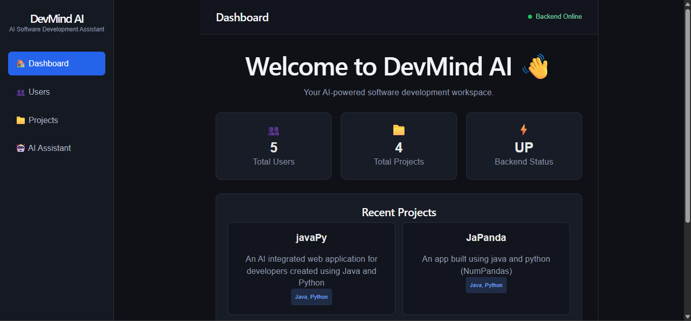
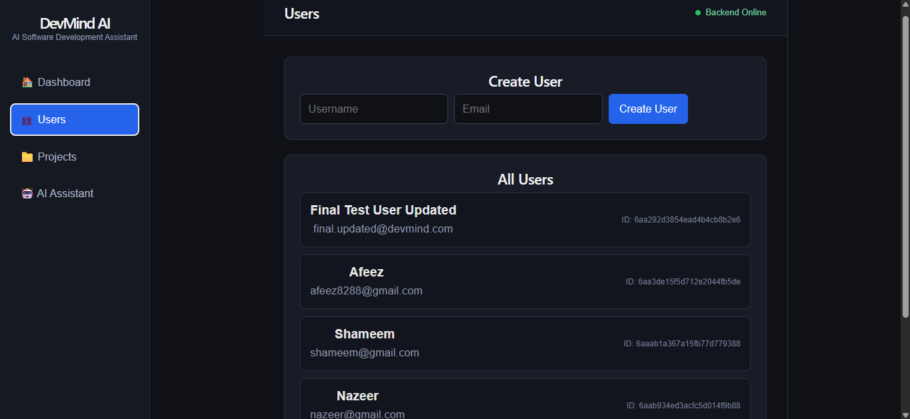
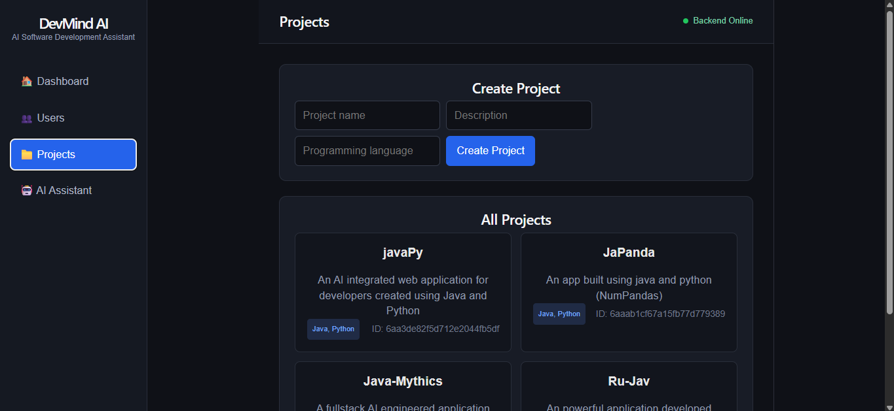
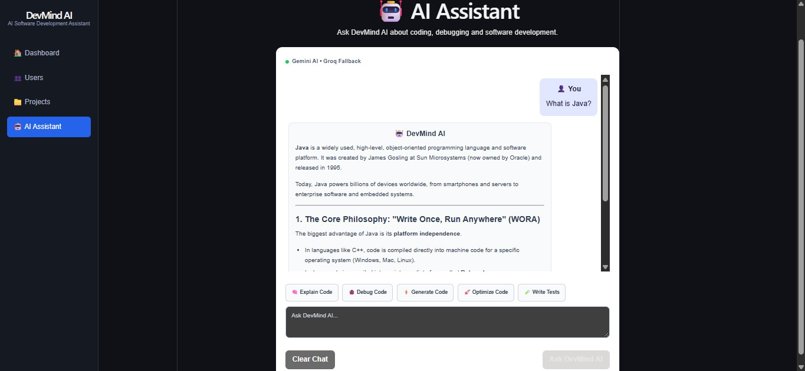

# 🤖 DevMind AI – AI-Powered Software Developer Assistant

A full-stack AI-powered software development assistant built to help developers understand, generate, debug, optimize, and improve code through an interactive AI workspace.

DevMind AI combines a **React + Vite frontend** with a **Java Spring Boot backend**, **MongoDB Atlas** persistence, and AI services using **Google Gemini as the primary provider with Groq as a fallback**.

---

## 🚀 Features

- 👤 User creation and management
- 📁 Project creation and management
- 🤖 AI-powered software development assistance
- 💡 Code explanation and understanding
- 🛠️ Code generation assistance
- 🐞 Code debugging assistance
- ⚡ Code optimization assistance
- 🧪 Test-generation assistance
- 💬 AI chat with conversation management
- 🔄 Streaming AI responses
- 🔀 Gemini as the primary AI provider with Groq as a fallback
- 🗄️ MongoDB Atlas persistence
- 🌐 RESTful API architecture
- 📚 Swagger / OpenAPI API documentation
- 🔐 Environment-based configuration
- ☁️ Cloud deployment using AWS Elastic Beanstalk and Vercel
- 📱 Responsive web interface

---

## 🌐 Live Application

**DevMind AI:** https://devmind-ai-snowy.vercel.app/

The application is deployed with a React + Vite frontend on Vercel and a Spring Boot backend on AWS Elastic Beanstalk, with MongoDB Atlas used for persistent data storage.

---

## 🎥 Screenshots & Demo

### 📊 Application Dashboard



The dashboard provides an overview of the DevMind AI workspace and the main application features.

### 👥 User Management



The user management interface allows users and application data to be managed through the DevMind AI workspace.

### 📁 Project Management



The project management interface allows users to create and manage software development projects.

### 🤖 AI Assistant



The AI Assistant provides interactive programming assistance for code understanding, generation, debugging, optimization, and improvement.

---

## 🏗️ Application Architecture

DevMind AI follows a layered full-stack architecture where the React frontend communicates with the Spring Boot backend through REST APIs. The backend manages application logic, MongoDB persistence, and AI provider routing.

<pre>
┌──────────────────────────────────────┐
│           React + Vite               │
│             Frontend                 │
│                                      │
│  Dashboard                           │
│  User Management                     │
│  Project Management                  │
│  AI Assistant                        │
└──────────────────┬───────────────────┘
                   │
                   │ REST API / HTTP
                   ▼
┌──────────────────────────────────────┐
│          Spring Boot Backend         │
│                                      │
│  Controllers                         │
│  Services                            │
│  AI Provider Router                  │
│  MongoDB Integration                 │
└───────────────┬──────────────┬───────┘
                │              │
                │              │
                ▼              ▼
      ┌────────────────┐  ┌─────────────────┐
      │ MongoDB Atlas  │  │  AI Providers   │
      │                │  │                 │
      │ Users          │  │ Google Gemini   │
      │ Projects       │  │       ↓         │
      │ Application    │  │ Groq Fallback   │
      │ Data           │  │                 │
      └────────────────┘  └─────────────────┘
</pre>

### Architecture Flow

**React + Vite → REST APIs → Spring Boot → MongoDB Atlas / AI Provider Router → Gemini / Groq**

---

## ☁️ Deployment Architecture

DevMind AI is deployed as a full-stack cloud application with the frontend, backend, database, and AI services running as separate components.

<pre>
┌──────────────────────────────┐
│       React + Vite           │
│          Frontend            │
└──────────────┬───────────────┘
               │
               ▼
┌──────────────────────────────┐
│           Vercel             │
│      Frontend Deployment     │
└──────────────┬───────────────┘
               │
               │ REST API
               ▼
┌──────────────────────────────┐
│       Spring Boot            │
│          Backend             │
└──────────────┬───────────────┘
               │
               ▼
┌──────────────────────────────┐
│     AWS Elastic Beanstalk    │
│      Backend Deployment      │
└──────────────┬───────────────┘
               │
          ┌────┴─────┐
          │          │
          ▼          ▼
┌────────────────┐  ┌──────────────────┐
│ MongoDB Atlas  │  │   AI Services    │
│   Database     │  │                  │
└────────────────┘  │ Google Gemini    │
                    │       ↓          │
                    │  Groq Fallback   │
                    └──────────────────┘
</pre>

### Production Deployment

| Component | Technology / Platform |
|---|---|
| Frontend | React + Vite |
| Frontend Hosting | Vercel |
| Backend | Java 21 + Spring Boot |
| Backend Hosting | AWS Elastic Beanstalk |
| Database | MongoDB Atlas |
| Primary AI Provider | Google Gemini API |
| Fallback AI Provider | Groq API |

---

## 🛠️ Tech Stack

### Backend

- Java 21
- Spring Boot
- Spring Data MongoDB
- REST APIs
- Maven

### Frontend

- React.js
- Vite
- JavaScript
- HTML5
- CSS3

### Database

- MongoDB
- MongoDB Atlas

### AI Integration

- Google Gemini API
- Groq API
- AI Provider Routing
- AI Fallback Handling
- Streaming AI Responses

### API & Documentation

- REST
- HTTP
- JSON
- Swagger / OpenAPI
- Postman

### Cloud & Deployment

- AWS Elastic Beanstalk
- Vercel
- MongoDB Atlas

### Development Tools

- IntelliJ IDEA
- VS Code
- Git
- GitHub
- Maven
- GitHub Copilot

---

## 📂 Project Structure

The project is organized into separate frontend and backend applications to maintain a clean full-stack architecture.

<pre>
devmind-ai/
│
├── backend/
│   └── devmind-backend/
│       │
│       ├── src/
│       │   ├── main/
│       │   │   ├── java/
│       │   │   │   └── com/
│       │   │   │       └── devmind/
│       │   │   │           └── backend/
│       │   │   │               ├── ai/
│       │   │   │               ├── controller/
│       │   │   │               ├── service/
│       │   │   │               ├── repository/
│       │   │   │               └── model/
│       │   │   │
│       │   │   └── resources/
│       │   │
│       │   └── test/
│       │
│       ├── pom.xml
│       └── mvnw
│
├── frontend/
│   ├── src/
│   │   ├── components/
│   │   ├── pages/
│   │   ├── services/
│   │   └── ...
│   │
│   ├── package.json
│   └── vite.config.js
│
└── README.md
</pre>

### Backend Structure

- **ai/** — AI provider implementations and provider routing
- **controller/** — REST API controllers
- **service/** — Application and business logic
- **repository/** — MongoDB data access
- **model/** — Application data models
- **resources/** — Application configuration and resources

### Frontend Structure

- **components/** — Reusable React components
- **pages/** — Application pages and views
- **services/** — Frontend API communication and related services

---

## 🔐 Environment Variables & Configuration

DevMind AI uses environment variables to keep database credentials and AI API keys outside the source code.

### Backend Environment Variables

For local backend development, create a `.env` file inside the `backend/devmind-backend/` directory:

```env
MONGODB_URI=your_mongodb_connection_string
AI_PROVIDER=gemini
GEMINI_API_KEY=your_gemini_api_key
GROQ_API_KEY=your_groq_api_key
PORT=8080
```

### Production Configuration

For production deployment, the required environment variables are configured through the deployment platform's environment settings rather than being stored in the source code.

The backend uses:

- `MONGODB_URI` — MongoDB Atlas connection string
- `AI_PROVIDER` — Selects the primary AI provider
- `GEMINI_API_KEY` — Google Gemini API authentication
- `GROQ_API_KEY` — Groq API authentication
- `PORT` — Application server port

### Frontend Environment Variables

For local frontend development, create a `.env.local` file inside the frontend project:

```env
VITE_API_BASE_URL=http://localhost:8080/api
```

### Security

> ⚠️ Never commit `.env`, `.env.local`, API keys, passwords, database credentials, or other sensitive configuration to GitHub.

Production secrets should always be configured through the deployment platform's environment-variable settings.

---

## ▶️ Running the Backend Locally

### Prerequisites

Make sure the following are installed:

- Java 21
- Maven
- MongoDB Atlas account
- Git

### Clone the Repository

```bash
git clone https://github.com/afeez-07/devmind-ai.git
cd devmind-ai
```

### Navigate to the Backend

```bash
cd backend/devmind-backend
```

### Configure Environment Variables

Create a `.env` file inside `backend/devmind-backend/` and add the required configuration:

```env
MONGODB_URI=your_mongodb_connection_string
AI_PROVIDER=gemini
GEMINI_API_KEY=your_gemini_api_key
GROQ_API_KEY=your_groq_api_key
PORT=8080
```

### Run the Application

Using the Maven wrapper on Windows:

```powershell
.\mvnw.cmd spring-boot:run
```

The backend will start at:

```text
http://localhost:8080
```

### Build the Application

To create a production-ready JAR file:

```powershell
.\mvnw.cmd clean package -DskipTests
```

The generated JAR file will be available inside:

```text
target/
```

### Health Check

After starting the backend, verify that the application is running by accessing:

```text
http://localhost:8080/api/health
```

---

## ▶️ Running the Frontend Locally

### Prerequisites

Make sure the following are installed:

- Node.js
- npm
- Git

### Navigate to the Frontend

From the project root:

```bash
cd frontend
```

### Install Dependencies

```bash
npm install
```

### Configure Environment Variables

Create a `.env.local` file inside the `frontend/` directory:

```env
VITE_API_BASE_URL=http://localhost:8080/api
```

### Start the Development Server

```bash
npm run dev
```

The frontend will be available at the local URL shown in the terminal, typically:

```text
http://localhost:5173
```

The React frontend communicates with the Spring Boot backend through the `VITE_API_BASE_URL` environment variable.

---

## ☁️ Deployment

DevMind AI is deployed using separate hosting platforms for the frontend and backend.

### Frontend Deployment

The React + Vite frontend is deployed on Vercel.

1. Push the frontend code to GitHub.
2. Import the repository into Vercel.
3. Configure the frontend environment variable:

```env
VITE_API_BASE_URL=your_backend_api_url
```

4. Deploy the application.

### Backend Deployment

The Spring Boot backend is deployed on AWS Elastic Beanstalk.

1. Build the backend JAR:

```powershell
.\mvnw.cmd clean package -DskipTests
```

2. Deploy the generated JAR to an AWS Elastic Beanstalk environment.
3. Configure the required environment variables in the Elastic Beanstalk environment:

```text
MONGODB_URI
AI_PROVIDER
GEMINI_API_KEY
GROQ_API_KEY
PORT
```

4. Deploy the application and verify the backend health endpoint.

### Database

MongoDB Atlas is used as the production database.

The backend connects to MongoDB Atlas using the `MONGODB_URI` environment variable.

### AI Providers

DevMind AI uses Google Gemini as the primary AI provider and Groq as the fallback provider.

If the primary provider encounters a supported failure such as rate limiting, timeout, or service unavailability, the backend can route the request to the fallback provider.

---

## 📚 API Documentation

DevMind AI provides RESTful APIs for user management, project management, AI interactions, and application workflows.

The backend API documentation is available through **Swagger / OpenAPI**.

### Swagger UI

When running the backend locally, open:

```text
http://localhost:8080/swagger-ui/index.html
```

The Swagger interface provides an interactive view of the available API endpoints and allows developers to test requests directly from the browser.

### API Base URL

For local development:

```text
http://localhost:8080/api
```

For production, the frontend uses the deployed Spring Boot backend URL through the `VITE_API_BASE_URL` environment variable.

### API Testing

API endpoints can also be tested using:

- Postman
- Swagger UI
- Browser-based requests where applicable

---

## 🔐 Authentication & Authorization

DevMind AI provides user management and project-based access through the Spring Boot backend.

### User Management

The application supports:

- User creation
- User retrieval
- User-specific project management
- User-specific AI conversations

### Project Management

Users can create and manage projects within the application. Projects are associated with users and stored in MongoDB Atlas.

### AI Access

AI interactions are handled through the backend rather than directly from the frontend. The backend manages communication with the configured AI providers and keeps API credentials protected through environment variables.

---

## 🤖 AI Provider Architecture

DevMind AI uses a provider-based architecture to integrate multiple AI services.

### Primary AI Provider

**Google Gemini** is configured as the primary AI provider for generating AI responses.

The Gemini integration supports:

- Code explanation
- Code generation
- Debugging assistance
- Code improvement
- Code optimization
- Test-generation assistance
- Streaming AI responses

### Fallback AI Provider

**Groq** is configured as the fallback AI provider.

When Gemini encounters a supported failure such as rate limiting, timeout, connection issues, or service unavailability, the backend can route the request to Groq.

### Provider Routing

The backend uses an AI provider router to manage communication between the application and the configured AI providers.

```text
User Request
     │
     ▼
AI Provider Router
     │
     ▼
Google Gemini
     │
     ├── Success ──► Return AI Response
     │
     └── Supported Failure
              │
              ▼
        Groq Fallback
              │
              ▼
        Return AI Response
```

This architecture allows DevMind AI to continue processing supported AI requests when the primary provider is temporarily unavailable or affected by rate limits.

---

## ✨ Project Features

### 👤 User Management

- Create and manage user accounts
- Maintain user-specific application data
- Support user-based project management

### 📁 Project Management

- Create and manage software development projects
- Associate projects with individual users
- Maintain project data using MongoDB Atlas

### 🤖 AI-Powered Development Assistance

- Explain and understand source code
- Generate code based on user requirements
- Identify and debug programming issues
- Improve and optimize existing code
- Generate test-related assistance
- Interact with the AI through conversational chat

### 💬 AI Chat

- Interactive AI-assisted conversations
- Conversation-based programming assistance
- Streaming AI responses
- Backend-managed AI provider communication

### 🔄 AI Provider Fallback

- Google Gemini as the primary AI provider
- Groq as the fallback provider
- Automatic fallback for supported provider failures
- Provider routing handled by the Spring Boot backend

### 🗄️ Data Persistence

- MongoDB Atlas for cloud database storage
- Spring Data MongoDB for database integration
- Persistent storage for users, projects, and application data

### 📚 API Documentation

- RESTful backend APIs
- Swagger / OpenAPI documentation
- API testing with Postman

### ☁️ Cloud Deployment

- React + Vite frontend deployed on Vercel
- Spring Boot backend deployed on AWS Elastic Beanstalk
- MongoDB Atlas used as the production database
- Environment-based configuration for production secrets

---

## 🚀 Future Enhancements

Potential future improvements for DevMind AI include:

- 🔐 Implement secure user authentication and authorization
- 🧠 Add support for additional AI providers
- 💻 Enhance AI-assisted code analysis and debugging
- 📊 Add project activity and usage analytics
- 🗂️ Improve project and conversation organization
- 🎨 Further enhance the user interface and user experience
- 🧪 Expand automated testing across backend and frontend
- ⚡ Improve application performance and response handling
- 📱 Further optimize the application for mobile devices
- 🔄 Enhance AI provider fallback and reliability mechanisms

---

## 👨‍💻 Author

**Afeez S**

Computer Science graduate focused on **Java backend and full-stack development**, with hands-on experience building applications using Java, Spring Boot, React.js, MongoDB, SQL, REST APIs, AI integrations, and cloud deployment.

### Connect With Me

- 💼 LinkedIn: https://www.linkedin.com/in/afeez-s-8a3534320/
- 🐙 GitHub: https://github.com/afeez-07
- 🌐 Portfolio: https://afeez07-portfolio.vercel.app/

---

## 📄 License

This project is developed for educational and portfolio purposes.

---
